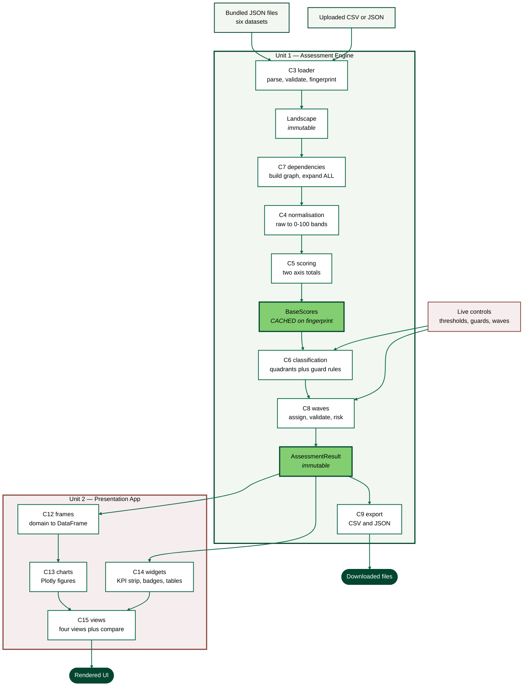

# Component Dependencies — BW-ACE

**Stage**: INCEPTION — Application Design

---

## 1. Dependency Matrix

Rows depend on columns. `X` marks a direct dependency.

| depends on → | C1 models | C2 config | C3 loader | C4 norm | C5 scoring | C6 class | C7 deps | C8 waves | C9 export | C10 service | C11 theme | C12 frames | C13 charts | C14 widgets | C15 views |
|---|---|---|---|---|---|---|---|---|---|---|---|---|---|---|---|
| **C1 models** | — | | | | | | | | | | | | | | |
| **C2 config** | X | — | | | | | | | | | | | | | |
| **C3 loader** | X | X | — | | | | | | | | | | | | |
| **C4 normalisation** | X | X | | — | | | | | | | | | | | |
| **C5 scoring** | X | X | | X | — | | | | | | | | | | |
| **C6 classification** | X | X | | | | — | | | | | | | | | |
| **C7 dependencies** | X | X | | | | | — | | | | | | | | |
| **C8 waves** | X | X | | | | | X | — | | | | | | | |
| **C9 export** | X | | | | | | | | — | | | | | | |
| **C10 service** | X | X | | X | X | X | X | X | | — | | | | | |
| **C11 theme** | | X | | | | | | | | | — | | | | |
| **C12 frames** | X | | | | | | | | | | | — | | | |
| **C13 charts** | X | X | | | | | | | | | X | X | — | | |
| **C14 widgets** | X | X | | | | | | | | | X | | | — | |
| **C15 views** | X | | | | | | | | X | | X | X | X | X | — |
| **C16 app** | X | X | X | | | | | | | X | X | | | X | X |

### Observations

- **No cycles.** The matrix is lower-triangular apart from C13→C12 and C13/C14→C11, all of which point strictly downward in the layering of §2.
- **C10 does not depend on C3.** The service receives an already-loaded `Landscape`. Only C16 knows about files, which keeps the service pure and independently testable.
- **C10 does not depend on C9.** Export consumes a result; the service produces one. C15 wires them together.
- **C15 depends on C9** so that download controls can serialise the current result.
- **C12 is the only component that imports pandas.** This is the deliberate containment of the pandas 3.x risk.
- **No component in C1–C10 depends on anything in C11–C16.** The engine has no knowledge of the presentation layer, so Unit 1 is buildable and testable before Unit 2 exists.

---

## 2. Layering

```
Layer 5   C16 app                          entry point, session state, navigation
Layer 4   C15 views                        the four views plus scenario comparison
Layer 3   C13 charts    C14 widgets        figure construction and UI fragments
Layer 2   C11 theme     C12 frames         styling and the DataFrame boundary
--------------------------------------  UNIT BOUNDARY  --------------------------
Layer 1   C10 assessment_service           orchestration
Layer 0   C3 loader   C4 normalisation   C5 scoring   C6 classification
          C7 dependencies   C8 waves   C9 export     computation
Layer -1  C1 models    C2 config           types and constants
```

Dependencies only ever point downward. The unit boundary sits between Layer 1 and Layer 2, crossed by exactly one type: `AssessmentResult`.

---

## 3. External Library Dependencies

| Component | External libraries |
|---|---|
| C1 models | stdlib only (`dataclasses`, `datetime`, `enum`, `typing`) |
| C2 config | stdlib only |
| C3 loader | stdlib only (`json`, `csv`, `hashlib`) |
| C4 normalisation | stdlib only |
| C5 scoring | stdlib only |
| C6 classification | stdlib only |
| C7 dependencies | **networkx** |
| C8 waves | stdlib only (`datetime`) |
| C9 export | stdlib only (`csv`, `io`, `json`) |
| C10 service | stdlib only |
| C11 theme | **streamlit** |
| C12 frames | **pandas** |
| C13 charts | **plotly**, **pandas** |
| C14 widgets | **streamlit** |
| C15 views | **streamlit** |
| C16 app | **streamlit** |

Eight of the ten engine components need nothing beyond the standard library. Only `networkx` reaches into the engine, and only into C7. This is why the engine unit tests need no fixtures beyond data.

---

## 4. Communication Patterns

| Pattern | Where used | Notes |
|---|---|---|
| **Direct function call with immutable arguments** | Throughout the engine | No shared mutable state anywhere in C1–C10 |
| **Return-value error reporting** | C3 → C16 | `ValidationReport` rather than exceptions, per NFR-6.4 |
| **Single aggregate result** | C10 → C15 | One `AssessmentResult` per render pass |
| **Cache-keyed memoisation** | C10 `compute_base` | Keyed on `landscape.fingerprint` |
| **Session state** | C16 only | No other component reads or writes it |
| **Two-phase computation** | C10 | `compute_base` then `apply_config`, the caching seam |

No events, no message passing, no callbacks, no dependency injection container. A single-process application of this size does not need them, and each would add indirection without reducing coupling.

---

## 5. Data Flow



### Text Alternative

```
INPUTS
  Bundled JSON files (six datasets) ──┐
  Uploaded CSV or JSON ───────────────┴──> C3 loader (parse, validate, fingerprint)
                                              │
                                              v
UNIT 1 — ASSESSMENT ENGINE                 Landscape (immutable)
                                              │
                                              v
                                     C7 dependencies (build graph, expand ALL)
                                              │
                                              v
                                     C4 normalisation (raw -> 0-100 bands)
                                              │
                                              v
                                     C5 scoring (two axis totals)
                                              │
                                              v
                                     BaseScores  *** CACHED on fingerprint ***
                                              │
                     Live controls ──────────>│
                     (thresholds, guards)     v
                                     C6 classification (quadrants + guard rules)
                                              │
                     Live controls ──────────>│
                     (wave settings)          v
                                     C8 waves (assign, validate, risk)
                                              │
                                              v
                                     AssessmentResult (immutable)
                                              │
                        ┌─────────────────────┼─────────────────────┐
                        v                     v                     v
UNIT 2 — PRESENTATION   C12 frames        C14 widgets           C9 export
                        (to DataFrame)    (KPI, badges)         (CSV, JSON)
                        │                     │                     │
                        v                     │                     v
                        C13 charts            │              Downloaded files
                        (Plotly figures)      │
                        │                     │
                        └────────> C15 views <┘
                                       │
                                       v
                                  Rendered UI

KEY PROPERTY: Live controls enter the flow only AFTER BaseScores. Threshold
changes therefore never invalidate the cache, which is why NFR-5.1 holds.
```

---

## 6. Unit Split Verification

| Check | Result |
|---|---|
| Does any Unit 1 component import a Unit 2 component? | No |
| Does any Unit 1 component import Streamlit or Plotly? | No |
| Can Unit 1 be unit-tested with Unit 2 absent? | Yes — all engine components are pure or file-based |
| How many types cross the boundary? | One: `AssessmentResult` (plus `Landscape` and the two config types, which C16 passes inward) |
| Does any Unit 2 component perform scoring arithmetic? | No — C11 to C16 read computed values only |
| Is the boundary enforced structurally or by convention? | Structurally: Unit 2 receives outputs and never holds the inputs needed to score |

---

## 7. Risks in the Dependency Structure

| Risk | Assessment | Mitigation |
|---|---|---|
| C12 as a single pandas chokepoint | Low. Concentrates conversion, but also concentrates the pandas 3.x behavioural risk in one reviewable module. | Unit-test `frames` against known results |
| C10 knows all engine components | By design — it is the orchestrator. Coupling is inward and one-directional. | Delegation only; the service implements no rules itself |
| `AssessmentResult` grows over time | Moderate. A single aggregate can accumulate fields. | Grouped sub-objects (`kpis`, `wave_plan`, `graph`) rather than a flat structure |
| C7 depends on `networkx` version behaviour | Low. Only graph construction and degree counting are used, both long-stable APIs. | Pin the version; avoid layout algorithms whose output changes between releases |
