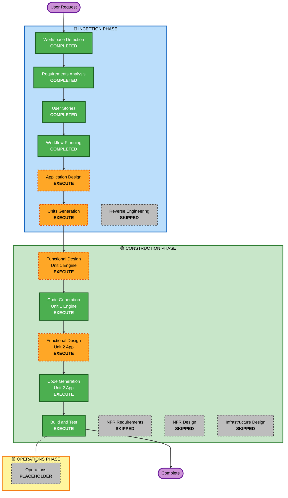

# Execution Plan — BW-ACE

**Project**: BW Object Assessment & Classification Engine
**Project Type**: Greenfield
**Date**: 2026-08-18
**Status**: Awaiting approval

**Inputs consumed**: `requirements/requirements.md` (approved), `user-stories/stories.md` and `personas.md` (approved), `plans/user-stories-assessment.md`

---

## 1. Detailed Analysis Summary

### 1.1 Transformation Scope

Not applicable — greenfield. There is no existing codebase, no packages to coordinate, and no migration path. The workspace contains only requirements text and AI-DLC rules.

### 1.2 Change Impact Assessment

| Impact area | Applies | Detail |
|---|---|---|
| **User-facing changes** | **Yes** | The entire deliverable is a user interface. Four views serving three personas, all new. |
| **Structural changes** | **Yes (new)** | A project structure is created from nothing. No existing architecture to disturb. |
| **Data model changes** | **Yes (new)** | Six JSON dataset schemas plus derived score and classification models. Upload path (FR-1.3) means schemas must be validated, not merely assumed. |
| **API changes** | **No** | No external or internal API surface. No network endpoints beyond the local Streamlit server. No integration with SAP or any other system. |
| **NFR impact** | **Yes** | Accessibility (WCAG AA, verified ratios), portability (Windows and Linux launch), offline operation, sub-500ms recomputation. |

### 1.3 Component Relationships

Not applicable — greenfield. Component boundaries will be established during Application Design.

### 1.4 Risk Assessment

- **Risk Level**: **Low–Medium**
- **Rollback Complexity**: **Easy.** Greenfield with no existing system, no shared infrastructure, no data to migrate. Reverting means deleting a directory.
- **Testing Complexity**: **Simple–Moderate.** The analytical engine is deterministic with a known reference output (5 / 13 / 4 and named edge cases), which makes it unusually testable. UI verification is limited to smoke tests.

**What raises the risk above Low**, despite the technical simplicity:

1. **Customer-facing consequence.** This is presented to Arla. A visibly wrong recommendation — the `IM100` failure mode caught during Requirements Analysis — costs credibility in a way a normal internal bug does not. Correctness of the engine matters more than the codebase size suggests.
2. **pandas 3.x.** The stack resolved to pandas 3.x during verification, a major version whose copy-on-write and string dtype behaviour differs from the 2.x series that most examples assume. Pinning contains it, but it is a genuine unknown rather than a settled quantity.
3. **Deferred numeric detail.** Requirements §4.6 explicitly deferred the exact normalisation band boundaries and complexity sub-weights to Functional Design. Those values determine every classification, so the design stage carries real weight rather than being a formality.

**What keeps it out of High**: no production system, no data loss possible, no security surface, no deployment, and a validated analytical model whose expected output is already documented.

---

## 2. Workflow Visualization



### Text Alternative

```
INCEPTION PHASE
  Workspace Detection ......... COMPLETED
  Reverse Engineering ......... SKIPPED   (greenfield)
  Requirements Analysis ....... COMPLETED
  User Stories ................ COMPLETED
  Workflow Planning ........... COMPLETED (this stage)
  Application Design .......... EXECUTE
  Units Generation ............ EXECUTE

CONSTRUCTION PHASE
  Per-unit loop, Unit 1 (Assessment Engine):
    Functional Design ......... EXECUTE
    NFR Requirements .......... SKIPPED
    NFR Design ................ SKIPPED
    Infrastructure Design ..... SKIPPED
    Code Generation ........... EXECUTE
  Per-unit loop, Unit 2 (Presentation App):
    Functional Design ......... EXECUTE
    NFR Requirements .......... SKIPPED
    NFR Design ................ SKIPPED
    Infrastructure Design ..... SKIPPED
    Code Generation ........... EXECUTE
  Build and Test .............. EXECUTE

OPERATIONS PHASE
  Operations .................. PLACEHOLDER

Sequence: Workspace Detection -> Requirements Analysis -> User Stories ->
Workflow Planning -> Application Design -> Units Generation ->
[Unit 1: Functional Design -> Code Generation] ->
[Unit 2: Functional Design -> Code Generation] ->
Build and Test -> Complete
```

---

## 3. Phases to Execute

### 🔵 INCEPTION PHASE

- [x] **Workspace Detection** — COMPLETED
- [x] **Reverse Engineering** — SKIPPED
  - **Rationale**: Greenfield. No source files, no build files, no project structure. Nothing exists to reverse engineer.
- [x] **Requirements Analysis** — COMPLETED
  - Comprehensive depth. 22 verification questions plus 4 clarification questions answered. Model validated numerically against the dataset before the document was written, which surfaced and corrected two misclassifications.
- [x] **User Stories** — COMPLETED
  - 3 personas, 22 stories across 8 capability epics, Given/When/Then criteria with concrete data expectations.
- [x] **Workflow Planning** — IN PROGRESS (this document)
- [ ] **Application Design** — **EXECUTE**
  - **Rationale**: Every component is new and needs its boundary defined. More specifically, NFR-8.1 requires that scoring logic contain no presentation code and presentation modules contain no scoring calculations. That separation only holds if the boundary is drawn deliberately before code exists, and it is the same boundary that makes the engine independently unit-testable per NFR-7.1. There is also a real interface to specify: what the engine exposes to the UI, and in what shape, given that four views and two export paths all consume the same computed result. Cheap to do at this size, and it prevents scoring logic leaking into view code where it becomes untestable.
- [ ] **Units Generation** — **EXECUTE**
  - **Rationale**: The work divides cleanly along a genuine dependency. The analytical engine has no dependency on the UI; the UI cannot render anything meaningful until the engine produces correct output. Splitting into two units lets the engine be built and verified against the reference distribution *before* any view work begins, which directly addresses the highest risk in §1.4 — that a scoring defect reaches a customer demo. Expected outcome is two units: `assessment-engine` and `presentation-app`. This is a recommendation; the stage itself will confirm the decomposition.

### 🟢 CONSTRUCTION PHASE

Per-unit stages are listed per unit, since the rules evaluate them per unit rather than once globally.

#### Unit 1 — Assessment Engine

- [ ] **Functional Design** — **EXECUTE**
  - **Rationale**: Mandatory rather than discretionary. Requirements §4.6 explicitly deferred the exact normalisation band boundaries and the complexity sub-weights to this stage, and those values determine every classification the tool produces. Also to be specified here: the recency multiplier, guard rule evaluation order relative to score-based classification, the wave assignment algorithm, dependency violation detection, and the risk score composition. This is the most consequential design stage in the project.
- [ ] **NFR Requirements** — **SKIP**
  - **Rationale**: The work this stage performs is already complete and approved. Performance targets are fixed in NFR-5.1 to NFR-5.3, and the tech stack is not merely chosen but empirically verified — the full stack was installed and imported on Python 3.14.0 during Requirements Analysis. Security and resiliency were explicitly opted out (Q18, Q19) and the excluded concerns are enumerated in requirements §3.9. Re-running this stage would restate settled decisions.
- [ ] **NFR Design** — **SKIP**
  - **Rationale**: Follows from skipping NFR Requirements. The stage rule makes NFR Design conditional on NFR Requirements having executed. No NFR patterns require design: there is no caching layer, no retry logic, no scaling strategy, no observability stack. The one NFR needing genuine design decisions is the accessible colour system, which is folded into Unit 2's Functional Design where it belongs alongside the views it governs.
- [ ] **Infrastructure Design** — **SKIP**
  - **Rationale**: There is no infrastructure. The application runs as a local process on a presenter's laptop. No cloud resources, no deployment target, no networking beyond localhost, no persistent storage beyond files in the repository. Requirements §3.9 excludes deployment entirely. The launch scripts are application code, not infrastructure.
- [ ] **Code Generation** — **EXECUTE** (always)
  - **Rationale**: Produces the data loading, validation, scoring, classification, guard rules, dependency analysis, and wave planning modules, plus the unit tests asserting the reference distribution required by NFR-7.2.

#### Unit 2 — Presentation App

- [ ] **Functional Design** — **EXECUTE**
  - **Rationale**: Two things need designing rather than improvising. First, the accessible colour system: the muted terracotta for Decommission (NFR-4.4) has to be chosen and its contrast verified, and the palette roles have to be mapped across headers, cards, charts, badges, and warning callouts without violating the prohibition on `#82ce71` as light-background text. Second, view composition: which of the 22 stories lands on which view, how state flows when a threshold moves and every view must update, and how the four views share one computed result. Deciding this before writing Streamlit code avoids restructuring later.
- [ ] **NFR Requirements** — **SKIP** — same rationale as Unit 1
- [ ] **NFR Design** — **SKIP** — same rationale as Unit 1
- [ ] **Infrastructure Design** — **SKIP** — same rationale as Unit 1
- [ ] **Code Generation** — **EXECUTE** (always)
  - **Rationale**: Produces the four views, theming, KPI strip, charts, scenario comparison, export paths, launch scripts, README, and UI smoke tests.

#### After both units

- [ ] **Build and Test** — **EXECUTE** (always)
  - **Rationale**: Runs the engine unit tests and UI smoke tests, verifies the launch scripts actually work from a clean state on this machine, confirms the reference distribution end to end, and produces the build and test instruction documents.

### 🟡 OPERATIONS PHASE

- [ ] **Operations** — **PLACEHOLDER**
  - **Rationale**: Stage is a placeholder in the AI-DLC ruleset. Nothing to do here regardless: there is no deployment, no monitoring, and no production environment for this PoC.

---

## 4. Stage Count Summary

| | Count | Stages |
|---|---|---|
| **Completed** | 4 | Workspace Detection, Requirements Analysis, User Stories, Workflow Planning |
| **To execute** | 7 | Application Design, Units Generation, Functional Design ×2, Code Generation ×2, Build and Test |
| **Skipped** | 9 | Reverse Engineering, NFR Requirements ×2, NFR Design ×2, Infrastructure Design ×2, Operations, plus per-unit duplicates |

Effective remaining approval gates: **7**.

---

## 5. Package Change Sequence

Not applicable — greenfield, no existing packages. The unit build order below serves the equivalent purpose.

### Unit Build Order

| Order | Unit | Depends on | Why this order |
|---|---|---|---|
| 1 | `assessment-engine` | Nothing | Pure computation over file inputs. Independently testable against the documented reference distribution. Must be provably correct before anything is built on it. |
| 2 | `presentation-app` | `assessment-engine` | Every view renders engine output. Building views against an unverified engine would conflate presentation bugs with scoring bugs. |

---

## 6. Estimated Timeline

Expressed in approval gates rather than developer-days, since this is an AI-driven build where wall-clock time is dominated by review cycles rather than typing.

| Stage | Gates | Notes |
|---|---|---|
| Application Design | 1 | Component boundaries and engine interface |
| Units Generation | 1 | Confirm the two-unit decomposition |
| Unit 1 Functional Design | 1 | The heaviest design stage — all deferred numeric detail |
| Unit 1 Code Generation | 2 | Plan gate, then generation gate |
| Unit 2 Functional Design | 1 | Colour system and view composition |
| Unit 2 Code Generation | 2 | Plan gate, then generation gate |
| Build and Test | 1 | Verification and instruction documents |

**Total remaining gates**: 9 (7 stages, two of which have separate plan and generation gates).

---

## 7. Success Criteria

### Primary Goal

A working, locally runnable application that classifies the 22 simulated Arla BW objects into Decommission, Replicate As-Is, and Rebuild as Data Product, explains every classification, visualises dependencies, plans migration waves, and is presentable to a customer without apology.

### Key Deliverables

- Six bundled JSON datasets reproducing source sections 3.1 to 3.6 exactly
- Assessment engine: loading, validation, normalisation, two-axis scoring, classification, guard rules, dependency analysis, wave planning
- Four views: dashboard, object detail, dependency analysis, wave planner
- Scenario comparison and on-demand CSV/JSON export
- `run.bat` and `run.sh`, plus a README covering both platforms with troubleshooting
- Unit tests over the engine, smoke tests over the views
- Build and test instruction documents

### Quality Gates

| Gate | Criterion |
|---|---|
| **Reference distribution** | Bundled dataset at default thresholds yields exactly 5 Rebuild, 13 Replicate As-Is, 4 Decommission |
| **Rebuild set** | Exactly `SC100`, `SC200`, `SA100`, `PR100`, `PR200` |
| **Decommission set** | Exactly `IN200`, `TR100`, `TR200`, `TM100` |
| **Guard rules** | `IN200` classified by dormancy ceiling; `IM100` protected by activity floor; no other object affected |
| **Threshold sensitivity** | `FI100GC` flips to Rebuild when the Effort threshold is lowered to 66 |
| **Explainability** | Every object's classification traceable to per-dimension contributions in the UI |
| **Accessibility** | All text meets WCAG 2.1 AA; `#82ce71` never used as text on light backgrounds; no meaning conveyed by colour alone |
| **Portability** | `run.bat` and `run.sh` both succeed from a clean checkout with Python as the only prerequisite |
| **Offline** | Full functionality with the network disconnected; typography falls back without breaking layout |
| **Performance** | Threshold change recomputes in under 500 ms; startup under 10 seconds |
| **Tests** | Engine unit tests and UI smoke tests all pass, runnable by one command on both platforms |
| **Code style** | Minimal comments per NFR-8.4; no scoring logic in UI modules per NFR-8.1 |

---

## 8. Notes on Stages Recommended for Skipping

Recorded so the reasoning can be challenged rather than assumed. Any of these can be added back on request.

**Reverse Engineering** is unambiguous — there is no code.

**NFR Requirements and NFR Design** are the two worth scrutinising, since the project does have substantial non-functional content. The argument for skipping is not that NFRs are unimportant here, but that the work those stages perform has already happened: requirements §3 contains nine NFR groups with measurable targets, the stack was selected *and* empirically verified, and the extension opt-outs bounded the scope explicitly. What remains is not NFR *design* but NFR *implementation*, which belongs in Code Generation. The single genuine design decision — the accessible colour system — has been deliberately routed into Unit 2's Functional Design rather than dropped.

**Infrastructure Design** would produce an empty document. There is no infrastructure to map.
